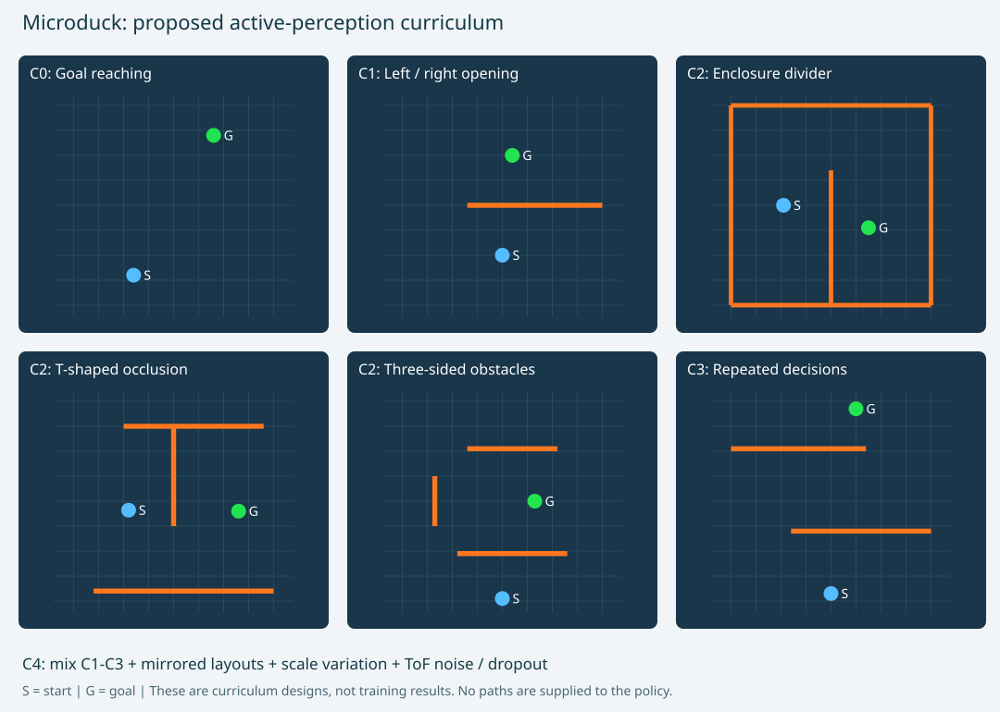

# Microduck 主动感知：APPLE 启发的课程训练与场景演示

参考 [APPLE: Toward General Active Perception via Reinforcement Learning](https://arxiv.org/abs/2505.06182)，为 Microduck 的 ToF 主动观察与避障建立训练原型，并保留可播放的 MuJoCo 脚本展示。

**当前状态：**脚本展示可运行；新增高层平面导航训练、历史 Transformer、SAC 与感知辅助损失、五级课程及评估入口。训练管线通过短程验证，**尚未证明策略已学会避障，也未接入双足动力学或真机**。本仓库是 APPLE 启发的本地适配，不是官方算法的完整复现。



方法对应关系、观测与动作、奖励、课程晋级和评估边界见 [方法与训练设计](docs/METHOD.md)。

官方模型来源：https://github.com/pollen-robotics/microduck_rl （完整源码保留于 upstream，保留其许可证）。

## 安装与运行

需要 Python 3.11、Git 和可用的 OpenGL 图形环境。克隆本仓库后，在项目目录执行：

```powershell
git submodule update --init --recursive
python -m venv .venv
.\.venv\Scripts\python.exe -m pip install -r requirements.txt
powershell -ExecutionPolicy Bypass -File .\start.ps1
```

然后打开 http://127.0.0.1:8765 。首次克隆也可以使用 `git clone --recurse-submodules <本仓库地址>`。

官方模型以 Git 子模块固定到 `cb70b792312d559a4da09064d92009079671815f`；其代码、模型和许可证保留在 `upstream`。本地虚拟环境、日志及带机器路径的生成文件不纳入版本控制。

场景：围墙隔板、T 形墙、三面障碍、交错墙。前三个按用户图片中的结构与视觉比例重建，并非原项目源代码或精确尺寸恢复。第三个将起点放在墙外，使进入绿色目标区域前需要主动扫描。

实际使用官方 MJCF/STL 机器人、独立 head_yaw 关节、MuJoCo 渲染与 mj_ray 8×8 墙体射线测距。ToF 最大量程 4 米，未命中为灰色；这是理想化测距，没有硬件噪声。

这是预先展示版本：使用脚本给定底盘轨迹和关节步态，通过 mj_forward 计算姿态，不进行动力学步进，不调用训练权重，也不声称强化学习已经学会避障。左右读数用于可视化比较，路线是预先编排的。

运动表现包含轻微身体侧摆、起伏、步速变化，以及摆头缓入缓出和小幅回调，均为有界的脚本效果。此页面仍运行脚本，不自动加载 `training/` 生成的权重。

验证：`.venv\Scripts\python.exe demo.py --verify`。输出在 output 中，包括场景 MJCF、截图及四条路线的完成/几何间隙/扫描记录。

## APPLE 启发的高层训练

在仓库根目录运行。CPU 可完成验证；正式训练预算与超参数仍需实验确定。

```powershell
.\.venv\Scripts\python.exe -m pip install -r requirements-training.txt
.\.venv\Scripts\python.exe -m unittest discover -s tests -v
# 短程检查：不是收敛训练
.\.venv\Scripts\python.exe -m training.train --steps 256 --warmup 32 --batch 16 --eval-every 100000 --output runs/smoke
# 正式实验入口：默认从 C0 开始，达标后自动晋级
.\.venv\Scripts\python.exe -m training.train --steps 200000 --seed 0 --output runs/seed0
# 独立测试；不要用 test 分数调参或晋级
.\.venv\Scripts\python.exe -m training.evaluate runs/seed0/checkpoint.pt --episodes 20 --split test
```

训练环境无渲染、无需加载机器人网格；默认使用 CPU。若系统安装了适配 GPU 的 PyTorch，可传 `--device cuda`。小网络是否受益需实测。

| 课程 | 场景 |
|---|---|
| C0 | 无障碍目标到达 |
| C1 | 单墙、左右开口镜像 |
| C2 | 围墙隔板、T 形、三面遮挡 |
| C3 | 交错墙、连续决策 |
| C4 | 混合布局、尺度变化、ToF 噪声和丢点 |

课程配置在 `configs/curriculum.json`。默认晋级要求：当前阶段至少 10000 步，连续三轮 validation 成功率 ≥80%、碰撞率 ≤10%；20% 回合复习较早课程。训练与评估场景均从配置生成，策略不会收到预设路径。

`runs/` 与权重不提交 Git；训练结束写入 `checkpoint.pt` 和 `metrics.json`。日志中的损失下降不等于导航成功，正式性能需使用多个训练种子和完整测试回合评估。

## 代码入口

- `demo.py` / `index.html`：原有 MuJoCo 脚本展示。
- `training/env.py`：部分可观测平面导航环境、训练专用真值标签、课程场景采样。
- `training/model.py`：共享历史编码器、actor、双 Q、感知预测分支。
- `training/train.py`：回放中重算感知惩罚、联合更新、验证与课程晋级。
- `training/evaluate.py`：权重重载、独立分阶段评估及头部控制干预。
- `training/draw_curriculum.py`：重新生成课程 SVG。
- `tests/test_training.py`：环境与训练约定测试。

原始论文、实现差异与当前适用范围见 [方法文档](docs/METHOD.md)。目前没有可作为实验结果报告的收敛策略或避障性能数据。
